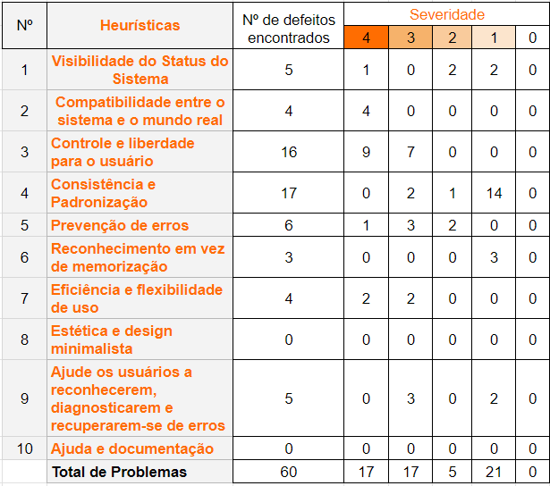

# Validação
A validação de software tem como propósito confirmar que um produto ou componente do produto atenderá a seu uso pretendido quando colocado no ambiente para o qual foi
desenvolvido.

A validação realizada nesse projeto foi feita com base na documentação do projeto de ensalamento Rooms, proposto por Vinícius Melchior e equipe.

## Processo de Validação
A validação realizada neste projeto foi a validação de usabilidade, utilizando a avaliação heurística de Nielsen que foi conduzida por três avaliadores que identificaram as violações das heurísticas de usabilidade na interface do site Rooms. Cada problema identificado foi classificado de acordo com sua severidade, permitindo priorizar ajustes com base no impacto na experiência do usuário.

Para mais detalhes acesse o documento completo: [Planilha de Validação](https://docs.google.com/spreadsheets/d/1PaUqwiiOnnjaC4XTD-J_XxNy9jhivgKGf1v_lziRsjU/edit?usp=sharing)

## Resultado
  
Resultado da avaliação heurística

Foram identificadas um total de 60 problemas de usabilidade. Sendo 17 defeitos catastróficos e graves, 5 simples, 21 cosméticos e nenhum sem importância (representado na tabela como 0).