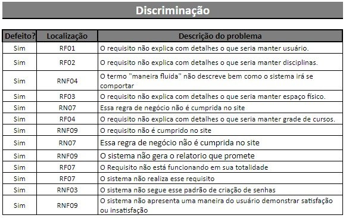

# Verificação
A verificação de software tem como propósito confirmar que cada serviço e/ou produto de trabalho do processo ou do projeto atende apropriadamente os requisitos especificados.

A verificação realizada nesse projeto foi feita com base na documentação do projeto de ensalamento Rooms, proposto por Vinícius Melchior e equipe.

## Processo de verificação
A documentação foi submetida a uma análise detalhada, focando nos requisitos funcionais e não funcionais, com o objetivo de identificar possíveis inconsistências e erros. A revisão foi conduzida por três inspetores, o que proporcionou uma maior abrangência e precisão na avaliação da documentação do sistema.

Para mais detalhes acesse o documento completo: [Planilha de Verificação](https://docs.google.com/spreadsheets/d/12lRuQRN1RZVjTRfxUYw9GB9MFeUEgD8lAWxtGO7qb_I/edit?usp=sharing)

## Resultado

  
Tabela de descriminação dos defeitos nos requisitos  

Foram identificados um total de 13 defeitos na documentação, sendo 6 nos requisitos funcionais e 7 nos requisitos não funcionais. A maioria dos defeitos detectados envolvia omissões, inconsistências e ambiguidades. Esses problemas foram apontados por todos os inspetores durante a análise.